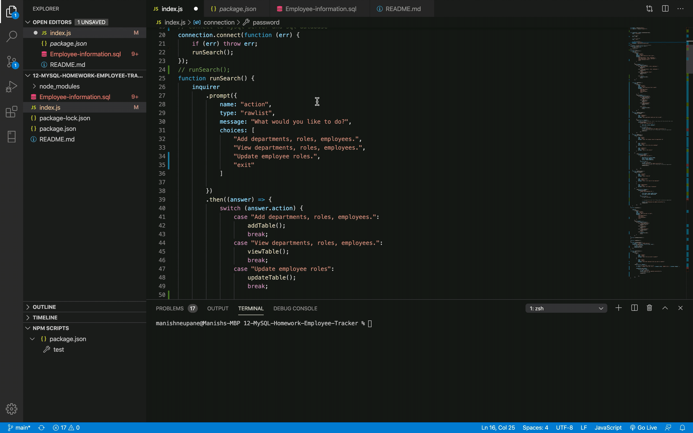

# 12-MySQL-Homework-Employee-Tracker
# Title
Employee Tracker

# Content
The assignment is about writing the code to keep the track of employee. It consists of database which holds the infromation prompted by the user.

# User story
The app allows user to add department, roles and employee. It also allows user to view tables and update data from the table. Once the user run the program it prompts with different questions asking the need of user, as per the user selected option the app performs the certain function.

# Built with
The application is built using VS Code. The code can be run in terminal using node. The database is created on workbench to holds the information. 

# Installation
 run 'npm install' or 'npm i' in terminal inside the working folder.
 run 'npm install mysql inquirer' to install the dependencies to mysql and inquirer.

# Usage
run 'node index.js' to prompt inquirer

# gif of app
;

# deployed link of app
(https://github.com/ManNeu/12-MySQL-Homework-Employee-Tracker)

# Contact
Manish Neupane
email: mrnish.are@gmail.com
phone: 0416508908

# Acknowledgments
Instructor
Teaching assistant 
classmates
